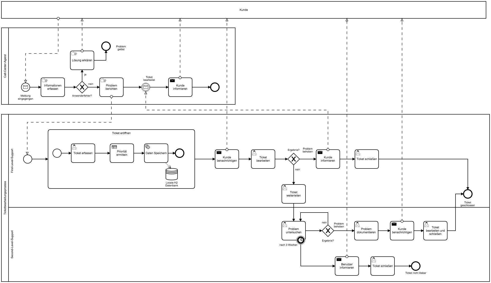
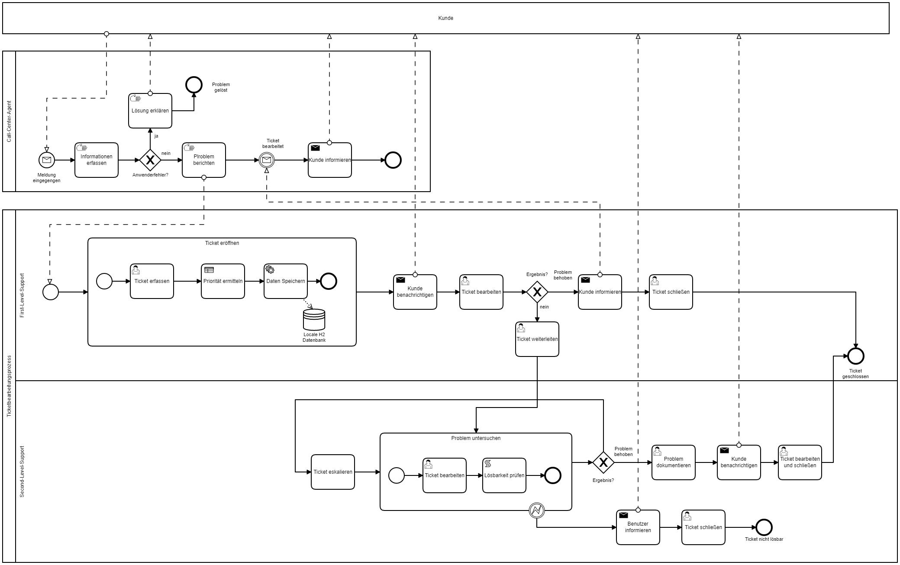
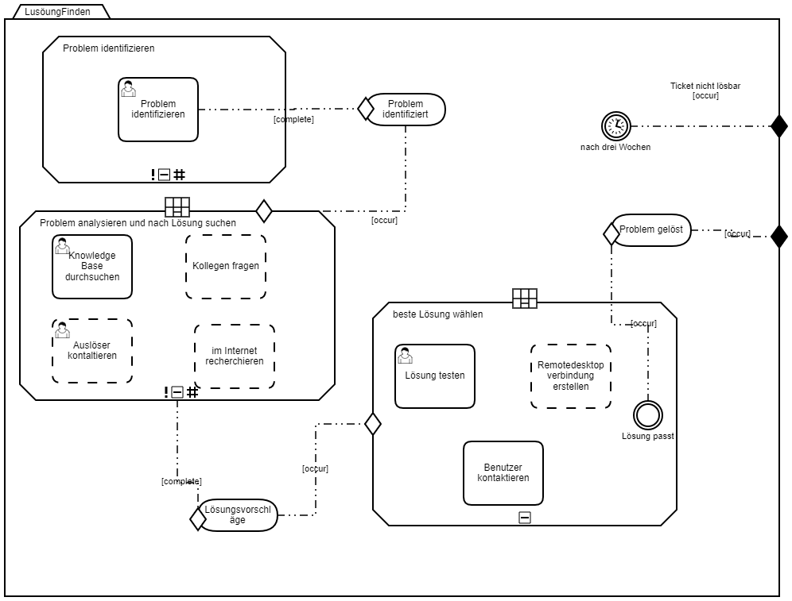
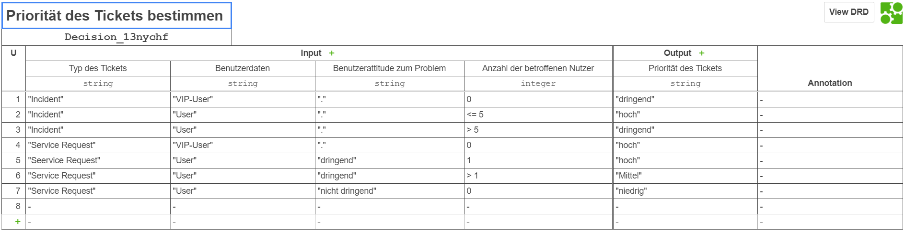
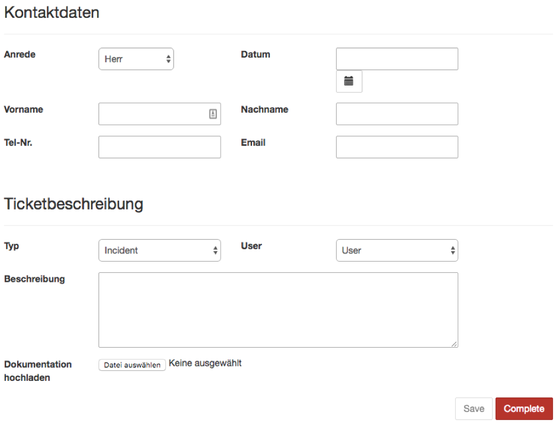

# Prozess: Ticketverarbeitung
## IST-Zustand


## Soll-Zustand



# Entwicklungsumgebung
---

- Eclipse IDE for Java Developers (Version: Oxygen.3a Release (4.7.3a))
- [Camunda BPM Tomcat 7.8.0](https://camunda.org/release/camunda-bpm/tomcat/7.8/camunda-bpm-tomcat-7.8.0.zip)
- [H2-Database Java Library (h2-1.4.197)](http://www.h2database.com/html/main.html) 


## Voraussetzung:
### H2 Tabelle erstellen:	
Im Grunde ist es nicht notwendig die Daten separat zu speichern, denn die Daten werden in der Prozessinstanz von Camunda BPM gespeichert. Dennoch werden die Daten zusätzlich in der H2 Datenbank gespeichert. Das hat den Vorteil, dass die Daten persistent gespeichert und auf die Daten individuell zugegriffen werden können. Ferner wird die H2 Datenbank für die Erzeugung der Ticket-ID verwendet. Der Befehl AUTO_INCREMENT(10000,1) führt dazu, dass er bei der Zahl 10000 beginnt und mit jedem neuen Datensatz eins hochzählt. 
 
```
CREATE TABLE SDDATA (TICKETID int(11) AUTO_INCREMENT(10000,1), Tickettyp varchar(20),user
varchar(15),prio varchar(10), title varchar(8), dat Timestamp, firstN varchar(15), lastN 
varchar(15), phoneN varchar(15),email varchar(30), description clob,PRIMARY KEY (TicketID))
````

## Einordnung des Themas in die Prozess-Landschaft (2 Punkte) 
Das Rechenzentrum (RZ) ist der zentrale IT-Dienstleister der Technischen Hochschule Brandenburg. Es stellt der Hochschule ein breites Spektrum an Dienstleistungen aus den Bereichen Rechen- und Datendienste, Kommunikation sowie Anwendungen und Prozessunterstützungen zur Verfügung. Neben Basisdienstleistungen wie Email-Server, Datennetz, Telefonnetz, WLAN stellt das RZ eine Virtuell Desktop Infrastucture (VDI) zur Verfügung. Die steigende Komplexität der IT-Dienste des RZ und die steigende Anzahl von Anfragen von Studierenden, Instituten, anderen Hochschulen und Unternehmen nach den IT-Diensten des RZ, ist es unerlässlich, ein IT-Service Management (ITSM) zu etablieren. Der Service Desk ist ein Bestandteil dieses ITSM.

## Abgrenzung und Beschreibung der Prozesse und Entscheidungen (6 Punkte)

### CMMN-Beschreibung



Um eine geeignete Lösung für das geöffnete Ticket zu finden, wurde CMMN-Diagramm erstellt. Zunächst wurde das CasePlanModel geöffnet, damit es das Gesamtmodell des Vorgangs der Suche nach einer passenden Lösung beinhaltet.
Dabei wurden eine 3 Stages erstellt:
- Das erste ist zur Identifizierung des Problems. 
- Das zweite ist dafür, welche Methode verwendet wird, um eine mögliche Lösungen zu finden. 
- Das letzte wurde erstellt, um die gefundene Lösungen zu testen und die beste Lösung auszuwählen.
Sobald der EventListener *Lösung passend* eintritt, wird die Bedingung am Milestone *Problem gelöst* erfüllt und der Milestone damit erreicht. Das Erreichen des Milestone *Problem gelöst* führt zur Erfüllung des Ausgangskriteriums am unteren Sentry des gesamten CasePlanModels. Der Fall wird damit abgeschlossen.
Falls es keine Lösung vorhanden ist, wird der EventListener *Lösung unpassend* aktiviert und der Fall abgeschlossen.

### DMN-Beschreibung:



Um die Prioritäten zum Starten der Behandlung von Problemen zu bestimmen, wird eine Prioritätsbewertungstabelle erstellt.
Diese Tabelle wurde auf 2 Hauptspalten kategorisiert:
Das Inputfeld umfasst vier Spalten: *Typ des Tickets*, *Benutzerdaten*, *Benutzerattitude zum Problem*,"Anzahl der betroffenen Nutzer"
Der Output: *Priorität des Tickets*

Zur Ausführung der DMN-Tabellen auf der Engine muss die Business Rule Task eingesetzt werden. Das kommt zuerst durch die Erstellung einer DMN-Tabelle über den Camunda Modeler vor. Danach muss im BPMN Prozess die DMN-Tabelle mit dem Business Rule Task über das Feld „Decision ref" im Properties Panel miteinander verbunden werden. Es muss den Namen der DMN-Tabelle über das Feld „Decision ref'' eingetragen werden, um die DMN-Tabelle mit dem Business Rule Task zu verknüpfen.
Es wurde im Properties Panel eine „Binding" als „latest“ und eine „Map Decision Result" als „singleEntry“ gewählt. Schließlich wurde das Feld „Result Variable“ durch die gleiche Variable „Priorität des Tickets“ wie in der DMN-Tabelle (Output).
geschrieben. 


### HTML Formularentwurf

Nach dem Erhalt die Informationen über das Problem vom Benutzer per E-mail, Fax oder Telefon, wird ein Ticket geöffnet. 
Zum Entwurf eines Tickets wurde dafür Hypertext Markup Language (HTML) verwendet. Dabei kann mehrere Tools wie zum Beispiel "NotePad ++" "Komodo Edit“, "Eclipse" usw. benutzt werden.
Das Ticket enthält diese folgenden Informationen:
Personalangaben (Vorname, Nachname, Tel-Nr, Email)
Anrede
Datum
Ticket ID 
Status
Typ (Incident, Service request)
User (VIP-User, User)
Beschreibung des Problems
Die Datei muss im Dateityp (.html) abgespeichert werden.
Hierbei muss Html-Datei im Maven-Projekt im Verzeichnis „src/main/webapp/forms“ hergestellt werden. 
Um die Html-Datei einem Task oder Start Event im ''Camunda Modeler'' zuzuweisen, wird erst auf das Element geklickt und es öffnet sich das Properties Panel. In dem Feld „Form Key“ muss der Name der Html-Datei nach ''embedded:app:forms/'' eingegeben werden und die Änderungen abgespeichert.
In Eclipse soll für ''Pom.xml'' Datei Run As als 5 Maven install gemacht werden.
Nach Run As wurde eine (0.0.1-SNAPSHOT.war) generiert, die nachher im Pfad (Server\apache-tomcat-8.0.47\webapps) hinzugefügt wird.
Schließlich wird ''Camunda BPM Engine'' geschaltet und durch Benutzer Name, Passwort (demo, demo) geöffnet. Im Camunda BPM Engine wird in Camunda Tasklist auf das taste Start Process geklickt, um das benötigte Projekt zu starten und die Html-Datei als Ticket darzustellen.

## Erläuterung fachlicher und technischer Modellierungsentscheidungen (6 Punkte)
### Pool Call-Center-Agent
Im Pool *Call-Center-Agent* versucht der Agent das Problem selbstständig zu erfassen und zu lösen. Hat er eine Lösung gefunden wird es dem Kunden direkt mitgeteilt. Ist keine Lösung zu finden, wird das Problem an den First-Level-Support berichtet. Dieser Vorgang ist manuell durchzuführen und ist somit nicht technisch in Camunda BPM implementiert.
### Pool First-Level-Support
Im Pool *First-Level-Support* wurde das *Start Event* anstelle von *Massage Start Event* verwendet, da sonst beim Starten des Prozesses, Camunda eine technische Implementierung erwartet und somit eine Fehlermeldung ausgibt. 
- Der Subprozess *Ticket eröffnen* stellt dem Benutzer erstmals ein Formular (Request.html) zur Verfügung, welches ausgefüllt werden muss. Im Anschluss wird ein Entscheidungsprozess gestartet, welches das Ticket nach Priorität (hoch, mittel, niedrig) einstuft. Die Erfassten Daten werden im nächsten Schritt in einer H2 Datenbank gespeichert. 
- In allen *Send Tasks* wurde ein Java Programm implementiert. Beim der Ausführung wird aus der H2 Datenbank die TicketID des letzten Eintrages ausgelesen und mit einer vorgefertigten Nachricht an den Kunden gesendet. Es gibt drei Varianten von Mitteilungen (Bestätigung, Problem gelöst und Problem nicht lösbar).
- Insgesamt gibt es zwei verschiedene HTML-Formulare (Request.html,Request1.html) die jedem *User Task* zugeordnet sind. Request.html ist für das erstmalige erfassen eines Problems (siehe Abbildung). Request1.html wird dazu genutzt, um weitere Informationen zum Ticket hinzuzufügen.




- Für das Erfassen und die Bearbeitung von Tickets wurde eine UserForm entwickelt. Camunda bietet die Möglichkeit embedded UserForm als HTML JavaScript und Bootstrap

## Reflexion von Schwachstellen und Optionen für Verbesserungen (3 Punkte)
Im IST-Zustand wurden alle spezifizierten Tasks technisch implement. Jedoch sind noch einige Aufgaben offen geblieben.  
Das BPMN-Modell musste mehrfach und bis zum Schluss überarbeitet werden, da es der technischen Implementierung zu wieder läuft.
Der Ist-Zustand ist im Bereich Second-Level-Support fehlerhaft. Denn das *Timer Event* produziert bei jedem durchlauf einen Token. Desshalb wurde eine Alternative modelliert, welches in dem Soll-Zustand zu finden ist. Das schwierige dabei ist das *Error Event* technisch zu implementieren. Nach stundenlanger Recherche im Internet könnte der Ansatz, der unter der URL:https://medium.com/@stephenrussett/throwing-bpmn-errors-with-javascript-in-camunda-c678f4b7d9ff](https://medium.com/@stephenrussett/throwing-bpmn-errors-with-javascript-in-camunda-c678f4b7d9ff) zufinden ist,die Lösung sein. Die Lösung ist demnach ein *Script Task*, welches ein Fehler bei der Überprüfung erzeugen kann, welches von dem *Error Event* aufgefangen wird.
Cammunda ist ein mächtiges Werkzeug, um Prozesse aus dem Geschäftumfeld technisch abzubilden. Jedoch erfordert es sehr viel technisches 
Know-How. Wärend der technischen Implementierung des Prozesses (Ticketbearbeitung), wurden die Themenfelder H2 Datenbank, Webserver, Maven, XML, SQL, Java, JavaScript, HTML und Rest-API berührt. Für das Projekt wurde die Entwicklungsumgebung Eclipse verwendet, um Java Programme zu entwickeln. Es wurden mehrere Programme geschrieben z.B für das Beschreiben und Auslesen einer H2 Datenbank oder das versenden von E-Mails. 
Manchmal war es sehr frustrierend wenn Camunda eine Fehlermeldung ausgegeben hat und man im Internet nur sehr wenig darüber gefunden hat.
Also wenn ein Unternehmen Camunda BPM verwenden möchte, empfiehlt es sich wirklich ein Paar Lehrgänge zu absolvieren und auf den Support von Camunda zurückzugreifen. 
Camunda ist aus meiner Sicht nicht wirklich für diesen Prozess geeignet, denn hier sind viele Benutzerinteraktionen von nöten. 
Diese lassen sich von Camunda nicht wirklich abbilden. Streng gesehen müsste man den Gesamtprozess in viele kleine Prozesse aufteilen wie z.B. in Ticket erfassen, Ticket suchen, Ticket weiterleiten, Ticket updaten, Ticket schließen, Lösung finden. Diese Prozesse können dann auf die Informationen der Datenbank zugreifen.

## Potenzielle Verknüpfungen zu anderen Prozessen (3 Punkte)

Es gibt zwei Möglichkeiten, Unser Prozess zu anderen Prozessen zu verknüpfen.
•	Passwort-Vergessen
•	Campuscard-Defekt
Zum einen Falls jemand sein Passwort vom Meincampus-Portal der Technischen Hochschule Brandenburg vergessen hat und auf Zugangsdaten-vergessen geklickt , kann das Rechenzentrum dafür ein Ticket eröffnen und daran arbeiten , bis ein neues Passwort erstellt wird.
Zum anderen wenn die Campuscard eines Studierendes defekt ist soll der Studierende persönlich im Studierendensekretariat die Campuscard abgeben. Das Studierendensekretariat leitet die Campuscard an Rechenzentrum weiter, das die Campuscard mit einem Lesegerät überprüft. Nunmehr kann das Rechenzentrum dafür ein Ticket eröffnen und nachher das Studierendensekretariat benachrichtigen , ob die Campuscard defekt oder nicht ist.


